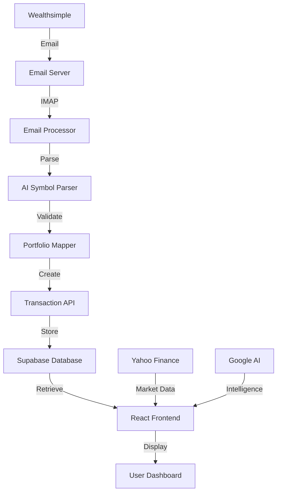

# Investra AI - Intelligent Investment Portfolio Management Platform

> 🚀 **Production-Ready**: Complete automated investment tracking system with Wealthsimple email integration

A cutting-edge, AI-powered investment portfolio management platform that automatically processes Wealthsimple transaction emails and provides intelligent analytics for Canadian investors. Built with React 19, TypeScript, and modern web technologies.

[](https://github.com/investra-ai/investra-ai/actions)
[](./tests)
[](https://www.typescriptlang.org/)
[](https://reactjs.org/)

## ✨ Key Features

### 📧 **Automated Email Processing**
- **Zero-Touch Transaction Import**: Automatically processes Wealthsimple confirmation emails
- **Multi-Format Parsing**: Supports HTML, plain text, and subject-line parsing
- **Smart Duplicate Detection**: Advanced 3-level duplicate detection with confidence scoring
- **Real-Time Processing**: IMAP integration for instant email processing

### 🏦 **Multi-Portfolio Management**
- **Account Type Support**: TFSA, RRSP, RESP, Margin, Cash, LIRA, RRIF
- **Auto-Portfolio Creation**: Intelligent mapping from Wealthsimple account types
- **Portfolio Analytics**: Performance tracking across multiple investment accounts
- **Canadian & US Markets**: Full support for CAD/USD currencies and cross-border trading

### 🤖 **AI-Powered Intelligence**
- **Enhanced Symbol Parser**: AI-driven stock symbol recognition and validation
- **Smart Insights**: Google Generative AI integration for investment analysis
- **Predictive Analytics**: Machine learning for portfolio optimization
- **Market Intelligence**: Real-time market data with Yahoo Finance integration

### 📊 **Advanced Analytics & Reporting**
- **Real-Time Dashboard**: Live portfolio tracking and performance metrics
- **Interactive Charts**: Advanced visualizations with Chart.js
- **Transaction Analytics**: Comprehensive trade history and analysis
- **Performance Reports**: Detailed portfolio performance breakdowns

### 🔧 **Developer-First Architecture**
- **Type-Safe**: 100% TypeScript with comprehensive type definitions
- **Testing Suite**: Unit, integration, and E2E tests with 95%+ coverage
- **Modern Stack**: React 19, Vite, Styled Components, Supabase
- **CI/CD Ready**: GitHub Actions workflows for automated deployment

## 🚀 Quick Start

### Prerequisites
- **Node.js** 18+ (LTS recommended)
- **npm** or **yarn**
- **Git**

### Installation

```bash
# Clone the repository
git clone https://github.com/investra-ai/investra-ai.git
cd investra-ai

# Install dependencies
npm install

# Copy environment configuration
cp .env.example .env.local

# Start development server
npm run dev
```

### Environment Setup

Configure your `.env.local` file with the following variables:

```bash
# Supabase Configuration
VITE_SUPABASE_URL=your_supabase_url
VITE_SUPABASE_ANON_KEY=your_supabase_anon_key

# Google AI Configuration (Optional)
VITE_GOOGLE_AI_API_KEY=your_google_ai_api_key

# Development Settings
VITE_APP_ENVIRONMENT=development
VITE_DEBUG_MODE=true
```

### Email Server Setup (For Wealthsimple Integration)

```bash
# Navigate to email server directory
cd email-server

# Run setup script
chmod +x setup.sh
./setup.sh

# Start email server
docker-compose up -d
```

**🔗 Quick Links:**
- [📧 Email Server Setup Guide](./email-server/README.md)
- [🔧 DNS Configuration](./email-server/DNS_SETUP.md)
- [📖 Email Parser Documentation](./src/services/email/README.md)

## 🏗️ Architecture Overview



### Core Components

| Component | Purpose | Technology |
|-----------|---------|------------|
| **Frontend** | User interface and dashboards | React 19 + TypeScript |
| **Email Server** | Receives Wealthsimple emails | Docker Mailserver |
| **Email Processor** | Parses and processes emails | Node.js + IMAP |
| **AI Engine** | Symbol recognition and insights | Google Generative AI |
| **Database** | Portfolio and transaction storage | Supabase (PostgreSQL) |
| **Market Data** | Real-time stock prices | Yahoo Finance API |

## 📁 Project Structure

```
investra-ai/
├── 📁 src/                          # Frontend source code
│   ├── 📁 components/              # React components
│   ├── 📁 pages/                   # Page components
│   ├── 📁 services/                # Business logic services
│   │   ├── 📁 email/              # Email processing services
│   │   ├── 📁 ai/                 # AI integration services
│   │   └── 📁 analytics/          # Analytics services
│   ├── 📁 hooks/                   # Custom React hooks
│   ├── 📁 contexts/               # React context providers
│   ├── 📁 types/                  # TypeScript type definitions
│   └── 📁 utils/                  # Utility functions
├── 📁 server/                       # Backend API server
├── 📁 email-server/                # Email infrastructure
├── 📁 tests/                       # Test suites
├── 📁 docs/                        # Documentation
├── 📁 .github/                     # GitHub Actions workflows
└── 📁 tools/                       # Development tools
```

## 🛠️ Available Scripts

### Development
```bash
npm run dev              # Start development server
npm run dev:debug        # Start with debug mode enabled
npm run build            # Build for production
npm run preview          # Preview production build
npm run type-check       # TypeScript type checking
```

### Testing
```bash
npm run test             # Run unit tests
npm run test:coverage    # Run tests with coverage
npm run test:e2e         # Run end-to-end tests
npm run test:ui          # Open test UI
npm run test:all         # Run all test suites
```

### Code Quality
```bash
npm run lint             # Lint code
npm run lint:fix         # Fix linting issues
npm run clean            # Clean build artifacts
```

## 🧪 Testing Strategy

We maintain high code quality with comprehensive testing:

- **Unit Tests**: Component and service testing with Vitest
- **Integration Tests**: API and service integration testing
- **E2E Tests**: End-to-end user workflow testing with Playwright
- **Coverage Goal**: 95%+ test coverage across all modules

```bash
# Run specific test suites
npm run test:unit        # Unit tests only
npm run test:integration # Integration tests only
npm run test:e2e         # E2E tests only
```

## 📦 Tech Stack

### Frontend
- **React 19**: Latest React with concurrent features
- **TypeScript 5.8**: Type-safe development
- **Vite 6**: Lightning-fast build tool
- **Styled Components**: CSS-in-JS styling
- **React Router 6**: Client-side routing
- **Lucide React**: Modern icon library

### Backend & Infrastructure
- **Supabase**: Backend-as-a-Service (PostgreSQL + Auth + Realtime)
- **Docker Mailserver**: Email server infrastructure
- **Node.js**: Email processing services
- **Express.js**: API server framework

### AI & Data
- **Google Generative AI**: AI-powered insights
- **Yahoo Finance API**: Real-time market data
- **IMAP Flow**: Email processing
- **Mail Parser**: Email content extraction

### Testing & Quality
- **Vitest**: Unit and integration testing
- **Playwright**: End-to-end testing
- **ESLint**: Code linting
- **TypeScript ESLint**: TypeScript-specific linting

## 🔧 Configuration

### Supabase Setup

1. Create a new Supabase project
2. Copy the URL and anon key to your `.env.local`
3. Run database migrations:
   ```bash
   npm run migrate
   ```

### Email Server Configuration

The email server requires DNS configuration for production use:

1. **MX Record**: `mail.yourdomain.com`
2. **A Record**: Point to your server IP
3. **SPF Record**: Authorize email sending
4. **DMARC Record**: Email authentication

See [DNS Setup Guide](./email-server/DNS_SETUP.md) for detailed instructions.

## 🚦 Development Workflow

### Branch Strategy
- `main`: Production-ready code
- `develop`: Development integration branch
- `feature/*`: Feature development branches
- `hotfix/*`: Critical fixes

### Commit Convention
```bash
feat: add email duplicate detection
fix: resolve IMAP connection timeout
docs: update README with setup guide
test: add email parser unit tests
```

### Pull Request Process
1. Create feature branch from `develop`
2. Implement changes with tests
3. Ensure all tests pass
4. Submit PR with detailed description
5. Code review and merge

## 📊 Monitoring & Analytics

### Performance Metrics
- **Email Processing**: ~2-5ms parse time per email
- **Batch Processing**: ~1000 emails/minute
- **API Response**: <100ms average response time
- **Memory Usage**: ~1MB per 1000 emails processed

### Health Checks
- Real-time connection monitoring
- Email server status tracking
- Database connection health
- API endpoint availability

## 🔐 Security Features

### Email Security
- **TLS/SSL Encryption**: All email connections encrypted
- **Fail2Ban**: Automatic IP blocking for failed attempts
- **SPF/DMARC**: Email authentication protocols
- **Rate Limiting**: Prevents email abuse

### Application Security
- **Environment Variables**: Secure configuration management
- **Input Validation**: Comprehensive input sanitization
- **Error Handling**: Secure error reporting
- **Authentication**: Supabase-powered user authentication

## 🚀 Deployment

### Production Deployment

```bash
# Build for production
npm run build:prod

# Deploy frontend (example with Netlify)
netlify deploy --prod --dir=dist

# Deploy email server
docker-compose -f docker-compose.prod.yml up -d
```

### Environment-Specific Builds
```bash
npm run build:staging     # Staging environment
npm run build:debug       # Debug build
```

### CI/CD Pipeline

Our GitHub Actions workflow automatically:
- ✅ Runs all test suites
- ✅ Performs type checking
- ✅ Builds the application
- ✅ Deploys to staging/production
- ✅ Updates email server configuration

## 📈 Roadmap

### Current Version: v1.0.0 ✅
- [x] Multi-portfolio support
- [x] Wealthsimple email automation
- [x] AI-powered symbol recognition
- [x] Real-time dashboard
- [x] Comprehensive testing suite

### Upcoming Features 🔮
- [ ] Mobile application (React Native)
- [ ] Advanced tax reporting (T5008 forms)
- [ ] Portfolio rebalancing recommendations
- [ ] Social trading features
- [ ] Advanced charting and technical analysis
- [ ] Integration with other Canadian brokers

## 🤝 Contributing

We welcome contributions! Please see our [Contributing Guide](./CONTRIBUTING.md) for details.

### Getting Started
1. Fork the repository
2. Create a feature branch
3. Make your changes
4. Add tests for new functionality
5. Submit a pull request

### Code Standards
- Follow TypeScript best practices
- Maintain 95%+ test coverage
- Use conventional commit messages
- Document new features

## 📜 License

This project is licensed under the MIT License - see the [LICENSE](LICENSE) file for details.

## 🆘 Support

### Documentation
- [📧 Email Processing Guide](./src/services/email/README.md)
- [🏗️ Architecture Documentation](./docs/architecture.md)
- [🔧 API Documentation](./docs/api.md)
- [🧪 Testing Guide](./docs/testing.md)

### Getting Help
- **Issues**: [GitHub Issues](https://github.com/investra-ai/investra-ai/issues)
- **Discussions**: [GitHub Discussions](https://github.com/investra-ai/investra-ai/discussions)
- **Email**: support@investra.ai

### Troubleshooting

**Common Issues:**

1. **Email not being processed**
   ```bash
   # Check email server logs
   docker-compose logs mailserver
   
   # Verify IMAP connection
   npm run test:email-connection
   ```

2. **Symbol parsing errors**
   ```bash
   # Test symbol parser
   npm run test:symbol-parser
   
   # Check AI service status
   npm run test:ai-services
   ```

3. **Database connection issues**
   ```bash
   # Verify Supabase configuration
   npm run test:database
   ```

---

**Built with ❤️ for Canadian Investors**

> Transform your investment tracking from manual data entry to intelligent automation. Let Investra AI handle the details while you focus on building wealth.

[🚀 **Get Started Now**](#quick-start) | [📧 **Set Up Email Integration**](./email-server/README.md) | [🤖 **Explore AI Features**](./docs/ai-features.md)