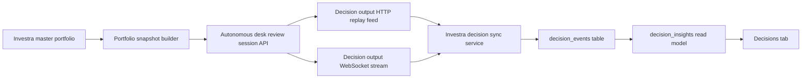

# Decision Desk Integration Spec

## Purpose

Define how Investra will connect to the autonomous trade desk so a user can run a master portfolio through the desk and review the resulting insights in a new `Decisions` tab.

This spec uses the canonical event model and replay semantics from [external-decision-output-spec.md](/Volumes/T7/projects/vnext/docs/external-decision-output-spec.md), but adapts the roles to this system:

- Investra is the portfolio system of record.
- The autonomous desk is the decision producer.
- Investra consumes the desk's decision output and presents it in a portfolio-centric UI.

## Goals

- Let the user select a master portfolio and run an analysis against the autonomous desk.
- Preserve child-account detail while showing a consolidated master-portfolio view.
- Store the desk's output as immutable events with replay-safe sync semantics.
- Make every analysis run reproducible from the exact submitted portfolio snapshot.
- Expose actionable insights in a dedicated `Decisions` screen without enabling auto-execution.

## Non-Goals

- Automated order execution from Investra.
- Trade routing back into broker APIs.
- Replacing Investra's portfolio or transaction source of truth.
- Real-time strategy authoring inside Investra.

## Current App Touchpoints

- Frontend routing is defined in [src/App.tsx](/Volumes/T7/projects/investra/src/App.tsx).
- Sidebar navigation is defined in [src/components/Layout.tsx](/Volumes/T7/projects/investra/src/components/Layout.tsx).
- Shared client types live in [src/types/index.ts](/Volumes/T7/projects/investra/src/types/index.ts).
- Protected API routes are mounted in [server/index.ts](/Volumes/T7/projects/investra/server/index.ts).
- Persistence is defined in [server/db/schema.ts](/Volumes/T7/projects/investra/server/db/schema.ts).
- Master portfolios with child accounts already exist in the portfolio model.

## Proposed User Flow

1. The user selects a master portfolio in the existing sidebar selector.
2. The user opens the new `Decisions` tab.
3. The user clicks `Run analysis`.
4. Investra builds a snapshot of the selected master portfolio, including child accounts, current positions, and recent transactions.
5. Investra persists the exact submitted snapshot on the run record and computes a snapshot hash before any network call is made.
6. Investra submits that exact immutable snapshot to the autonomous desk using an idempotent request.
7. The autonomous desk creates a review session and emits canonical decision-output events.
8. Investra backfills the event stream over HTTP, listens for low-latency updates over WebSocket, and stores the resulting immutable events locally.
9. The `Decisions` tab renders:
   - latest recommendations
   - portfolio-level warnings
   - per-position suggestions
   - raw event timeline for audit and debugging

## Snapshot Immutability

This is a hard rule, not an implementation detail.

- Every `decision_run` must persist the exact request payload submitted to the desk.
- The same run must never be recomputed later from current live positions or transactions.
- Any re-render, replay, or debugging view for that run must read from the stored snapshot, not from the current portfolio state.

Why this matters:

- reproducibility
- auditability
- support debugging
- deterministic comparisons between two runs of the same portfolio

Recommended implementation:

- persist `snapshot_json`
- persist `snapshot_hash`
- persist `schema_version`
- use `snapshot_hash` plus request idempotency to prevent duplicate run creation

## Integration Architecture



## Contracts

### 1. Outbound Contract: Portfolio Review Request

The external spec defines how decision output should be consumed, but it does not define how Investra asks for a portfolio review. The autonomous desk should expose a new write endpoint for that request.

Recommended desk endpoint:

- `POST /api/portfolio-review-sessions`

Request requirements:

- accept an `Idempotency-Key` header or equivalent field
- reject malformed schema versions clearly
- return the accepted `review_session_id`

Recommended request shape:

```ts
interface PortfolioReviewRequest {
  schema_version: string;
  portfolio_id: string;
  portfolio_name: string;
  as_of: string; // ISO-8601 UTC
  base_currency: string;
  requested_by_user_id: string;
  requested_by_user_email: string;

  accounts: Array<{
    account_id: string;
    account_name: string;
    account_type: "master" | "child";
    parent_account_id: string | null;
    currency: string;
  }>;

  positions: Array<{
    portfolio_id: string;
    account_id: string;
    asset_id: string;
    symbol: string;
    asset_type: string;
    quantity: number;
    avg_cost_basis: number;
    market_value: number | null;
    unrealized_pl: number | null;
    strike_price: number | null;
    expiration_date: string | null;
    option_type: "call" | "put" | null;
  }>;

  recent_transactions: Array<{
    id: string;
    account_id: string;
    symbol: string;
    type: string;
    quantity: number;
    price: number;
    fees: number;
    trade_date: string;
    source: string;
  }>;

  constraints: {
    mode: "read_only";
    allow_trade_execution: false;
  };
}
```

Recommended response shape:

```ts
interface PortfolioReviewSessionAccepted {
  review_session_id: string;
  accepted_at: string; // ISO-8601 UTC
  status: "accepted";
}
```

### 2. Inbound Contract: Canonical Decision Output

Use the event shape from [external-decision-output-spec.md](/Volumes/T7/projects/vnext/docs/external-decision-output-spec.md) as the desk's canonical output contract.

Required desk endpoints:

- `GET /api/capabilities`
- `GET /api/decision-output`
- `GET /api/decision-output/:event_id`
- `/ws` event type `decision_output`

Event rules:

- every event must carry `schema_version`
- `event_id` is the dedupe key.
- `created_at` is the ordering key.
- delivery is at-least-once
- WebSocket is low-latency only
- HTTP replay is the repair loop
- every event must carry `source`
- every event must carry `review_session_id`
- every event must carry `portfolio_id`
- `requested_by_user_id` is recommended for audit and debugging

Required envelope fields:

```ts
interface DecisionOutputEventEnvelope {
  schema_version: string;
  event_id: string;
  event_type: string;
  created_at: string;
  source: "runtime" | "academy" | "manual_test";
  review_session_id: string;
  portfolio_id: string;
  session_id: string | null;
  cycle_id: string | null;
  payload: Record<string, unknown>;
}
```

Filtering rules:

- Investra should default to `source=runtime`.
- `academy` and `manual_test` events should be excluded from normal portfolio analysis views unless explicitly requested.

Cursor rules:

- if `after_event_id` is present, it takes precedence over `since`
- `since` is for initial bootstrap and periodic repair loops
- clients should not combine both to express different cursors in the same request

Cycle rules:

- all events produced from one autonomous-desk analysis pass should share the same `cycle_id`
- consumers may use `cycle_id` to reconstruct one logical decision pass

Payload stability rules:

- each event type must define a stable set of guaranteed top-level fields
- `payload` is reserved for type-specific detail and optional future extensions
- consumers should not rely on undocumented keys inside `payload`

Event taxonomy note:

- keep `event_type` aligned with the desk's actual runtime semantics
- if `router.skipped` is not a real desk state, do not expose it externally just because it appeared in earlier draft language
- the external contract should only publish event types that map to real internal states

### 3. Review Session Correlation

The desk should include a stable correlation value that lets Investra associate returned events with the run that triggered them.

Recommended approach:

- Include `review_session_id` in every event as a first-class field and repeat it in the event `payload` if needed by the desk.
- Include `portfolio_id` in every event as a first-class field.
- Include `requested_by_user_id` when available.
- Persist that value in Investra `decision_runs.externalSessionId`.

### 4. Capability Handshake

Before creating a run, Investra should fetch desk capabilities to confirm schema compatibility.

Recommended desk endpoint:

- `GET /api/capabilities`

Recommended response fields:

- `desk_version`
- `health_status`
- `supported_decision_output_schema_versions`
- `supported_portfolio_review_request_versions`
- `supported_event_types`
- `default_source`

Investra should refuse to submit a run if the configured request schema version is unsupported.

## Investra Data Model Changes

Add the following tables to [server/db/schema.ts](/Volumes/T7/projects/investra/server/db/schema.ts).

### `decision_runs`

One row per analysis request submitted from Investra to the autonomous desk.

Suggested columns:

- `id`
- `user_id`
- `portfolio_id`
- `external_session_id`
- `request_idempotency_key`
- `snapshot_json`
- `snapshot_hash`
- `schema_version`
- `status`
- `requested_at`
- `last_synced_at`
- `sync_cursor_event_id`
- `sync_cursor_created_at`
- `completed_at`
- `error_message`

`status` should be a controlled state machine, not a free-form string:

- `pending_submission`
- `accepted`
- `syncing`
- `complete`
- `partial_error`
- `failed`

### `decision_events`

Immutable local copy of the desk's canonical event stream.

Suggested columns:

- `id`
- `decision_run_id`
- `event_id`
- `schema_version`
- `source`
- `review_session_id`
- `portfolio_id`
- `event_type`
- `created_at`
- `session_id`
- `cycle_id`
- `proposal_id`
- `decision_id`
- `execution_order_id`
- `position_id`
- `job_id`
- `instrument`
- `side`
- `action`
- `provider`
- `model`
- `payload_json`
- `ingested_at`

Constraints:

- unique index on `event_id`
- index on `decision_run_id, created_at`
- index on `review_session_id, created_at`

### `decision_insights`

Derived read model for the UI. This table is optional in phase 1 if the UI can derive directly from `decision_events`, but it will simplify rendering and filtering.

Suggested columns:

- `id`
- `decision_run_id`
- `portfolio_id`
- `account_id`
- `asset_id`
- `symbol`
- `insight_type`
- `headline`
- `summary`
- `confidence`
- `recommended_action`
- `status`
- `source_event_id`
- `created_at`

## Investra Backend Changes

### New Modules

Recommended additions:

- `server/lib/decisionDeskClient.ts`
  Creates review sessions and fetches replay pages from the desk.
- `server/lib/decisionSync.ts`
  Handles initial backfill, WebSocket subscription, dedupe, and repair-loop polling.
- `server/lib/decisionTransform.ts`
  Converts raw canonical events into UI-friendly insights.
- `server/routes/decisions.ts`
  Exposes Investra's internal API for the frontend.

### New Investra API Endpoints

Add a protected route group mounted from [server/index.ts](/Volumes/T7/projects/investra/server/index.ts).

Recommended endpoints:

- `POST /api/decisions/runs`
  Start a new analysis for the active master portfolio.
- `GET /api/decisions/runs`
  List runs for the current user and portfolio.
- `GET /api/decisions/runs/:id`
  Return run metadata and sync status.
- `GET /api/decisions/runs/:id/events`
  Return raw canonical events.
- `GET /api/decisions/runs/:id/insights`
  Return latest actionable insights.

Run creation rules:

- the request must generate and persist a `request_idempotency_key`
- duplicate submits with the same key must return the same run
- the exact submitted snapshot must be persisted before contacting the desk

### Sync Semantics

Follow the external spec exactly:

1. On run creation, start an HTTP backfill from the desk.
2. Open WebSocket for low-latency `decision_output` events.
3. Every 15-60 seconds, poll `GET /api/decision-output?since=...` as a repair loop.
4. Dedupe on `event_id`.
5. Store the last seen `event_id` and `created_at` on `decision_runs`.

Cursor handling rules:

- when continuing a known stream, prefer `after_event_id`
- when bootstrapping a run or repairing a gap, use `since`
- if the desk receives both values, it should honor `after_event_id` and ignore `since`

Stale-run policy:

- if the desk accepts a run but no events arrive within the configured timeout window, mark the run `partial_error`
- show `waiting on desk` in the UI
- allow manual retry or repair sync without creating a new run by default

## Investra Frontend Changes

### New Route and Navigation

Add:

- `DecisionsPage` in `src/features/decisions/DecisionsPage.tsx`
- `/decisions` route in [src/App.tsx](/Volumes/T7/projects/investra/src/App.tsx)
- `Decisions` nav item in [src/components/Layout.tsx](/Volumes/T7/projects/investra/src/components/Layout.tsx)

### New Client Types

Extend [src/types/index.ts](/Volumes/T7/projects/investra/src/types/index.ts) with:

- `DecisionRun`
- `DecisionEvent`
- `DecisionInsight`
- `PortfolioReviewRequest`

### Decisions UI Layout

Recommended sections:

- header
  Shows selected master portfolio, latest run status, and `Run analysis`.
- insights list
  Shows actionable recommendations grouped by type such as `buy`, `trim`, `exit`, `hold`, `hedge`, and `rebalance`.
- portfolio warnings
  Shows concentration, overlap, expiration, or risk flags.
- event timeline
  Shows raw canonical events for traceability.

Phase-1 UX rules:

- read-only only
- no trade buttons
- no `approve`, `execute`, or `send order` actions
- allow only `run analysis`, `refresh`, and `view details`
- always show source event ids for debugging

## Security

Phase 1:

- use a dedicated bearer token between Investra and the desk
- keep integration read-only from Investra's perspective after session creation
- restrict desk access to trusted LAN hosts

Phase 2:

- rotate tokens
- optional IP allowlist
- explicit health endpoint for sync readiness

## Observability

Add structured logs for:

- run submission success/failure
- HTTP replay progress
- WebSocket connect/disconnect
- dedupe drops
- transform errors when building insights

Recommended metrics:

- decision runs started
- sync lag seconds
- events ingested
- duplicate events ignored
- runs in error state
- events filtered by non-runtime source

## Retention Policy

Decide retention up front so immutable events do not become an unbounded junk drawer.

Recommended phase-1 policy:

- keep `decision_events` as the raw audit ledger
- do not prune raw events in phase 1
- allow `decision_insights` to be rebuilt from raw events
- if pruning is added later, prune derived read models first and archive raw events before deleting them

If storage becomes material, add archival before any hard delete policy is introduced.

## Delivery Plan

### Phase 0: Contract Freeze

- confirm outbound `PortfolioReviewRequest`
- confirm inbound `DecisionOutputEvent`
- confirm how `review_session_id` is returned and propagated

### Phase 1: Backend Foundation

- add schema and migrations
- add snapshot persistence and hashing
- add desk client
- add run creation and replay sync
- persist raw canonical events

### Phase 2: Decisions Tab

- add route, nav, and page shell
- render run history and event timeline
- surface only first-pass derived insights:
  - portfolio warning
  - position suggestion
  - portfolio recommendation

### Phase 3: Production Hardening

- add auth, retries, and better failure recovery
- add metrics and health checks
- refine insight grouping and filters

## Acceptance Criteria

- A user can open `Decisions`, select a master portfolio, and start an analysis.
- Investra submits exactly one portfolio snapshot for that run.
- The exact submitted snapshot is stored immutably on the run and is never recomputed from live portfolio state.
- Returned desk events are stored immutably and deduped by `event_id`.
- A dropped WebSocket connection does not cause silent data loss because HTTP replay repairs the gap.
- The UI shows consolidated master-portfolio recommendations while preserving child-account traceability.
- The integration remains read-only from Investra into the desk's output path.

## Open Questions

- Does the desk need cash balances, sector tags, or target allocation inputs that Investra does not currently model?
- Should each run include all recent transactions or only current positions plus a short lookback window?
- Should the first release support manual runs only, or also scheduled re-analysis?
- Which decision categories should be first-class in the UI: `rebalance`, `trim`, `exit`, `add`, `hedge`, `hold`, or a smaller subset?
